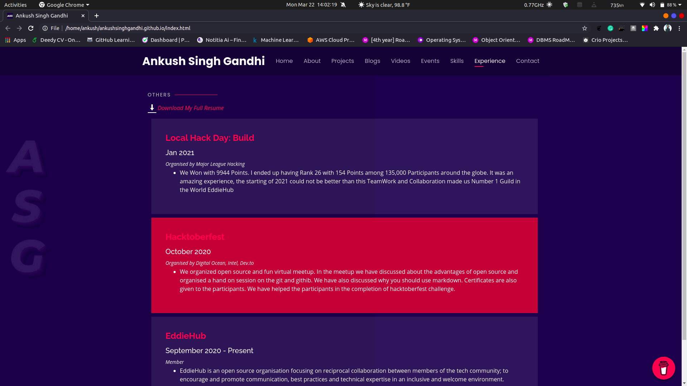
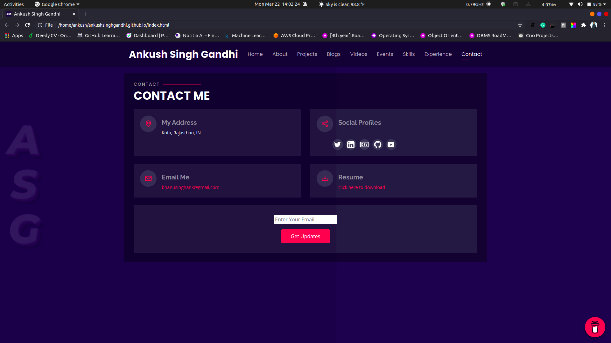

  

<h1 align="center">
  ASG Portfolio Website Version 2.0
</h1>

  The second iteration of <a href="https://ankushsinghgandhi.gihub.io/" target="_blank">ankushsinghgandhi.github.io</a> built on top of Personal Template from <a href="https://bootstrapmade.com/demo/Personal/" target="_blank">Bootstrapmade.com </a> and hosted on <a href="https://pages.github.com/" target="_blank">Github Pages</a>

### TL;DR

Yes, you can fork this repo. Please give proper credit To Me (<a href="https://github.com/ankushsinghgandhi">@ankushsinghgandhi</a>) for changes, modification and fixes in orignal template and to <a href="https://bootstrapmade.com/demo/Personal/" target="_blank">Bootstrapmade.com </a> for this awesome template . Thanks!

Do these before using this project -

- Remove Google Analytics section from index.html

- Remove Google Feedburner in contact me section from index.html

- Remove Schedule Meet Section from index.html

- Delete Google site verification file "google54e55fc6f41da759.html"

- Delete CNAME file

- Edit & Enjoy

### SCREENSHOTS

## Coded with ❤ by ASG

