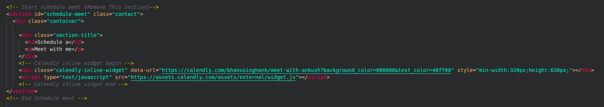
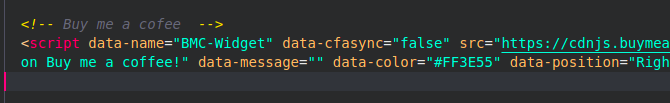

  The second iteration of my personal portfolio website built on top of Personal Template from <a href="https://bootstrapmade.com/demo/Personal/" target="_blank">Bootstrapmade.com</a>. deployed at <a href="https://ankushgandhi.com/portfolio-v2.0-old/" target="_blank">ankushgandhi.com/portfolio-v2.0-old/</a>

### TL;DR

Yes, you can fork this repo. Please give proper credit To Me (<a href="https://github.com/ankushsinghgandhi">@ankushsinghgandhi</a>) for changes, modification and fixes in orignal template and to <a href="https://bootstrapmade.com/demo/Personal/" target="_blank">Bootstrapmade.com </a> for "personal" template . Thanks!

Do these before using this project -

1. Remove Schedule Meet Section from index.html

2. Remove/change buy me a cofee widget

3. Edit & Enjoy

### SCREENSHOTS

## Coded with ❤ by ASG

